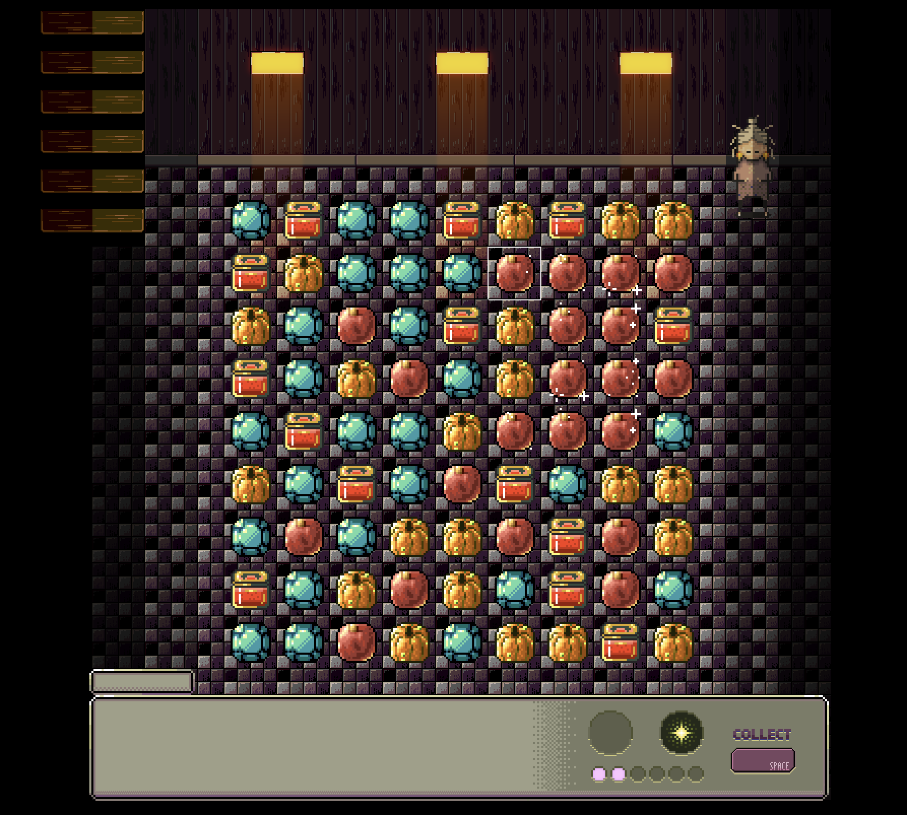

# tia_transita_game
A game with Phaser JS.

Tia Tránsita is a puzzle **match 3** game in which the player has to collect ingredients for Tía Tránsita, a mysterious witch who commanded her oldest niece to prepare a potion for her return.
The proportions of collected **ingredients** vary, producing different effects. There are three branches of magic that will develop based on the predominant ingredient type, **astrology**, **necromancy** and **labour**, each of which has a special effect on the game board.
Will the player be able to prepare the correct potion for when Tía Tránsita returns?

#### Setup
For first time setup, run `npm install`.

#### Build and serve
Run `npm start` to enable development web server on port `9000`

#### Manual publish to web directory
The script `publish.sh` will copy the contents of `public/` into the web server folder. Such directory will depend on your own web server configuration, it defaults to `/var/www/html`. The script can take a subdirectory as the first argument, that will append to `/var/www/html`.
